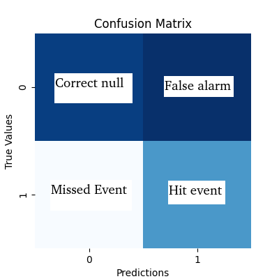
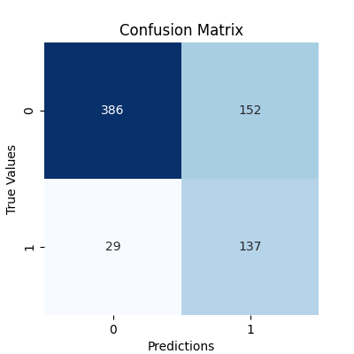
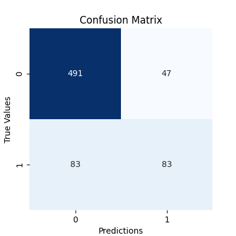
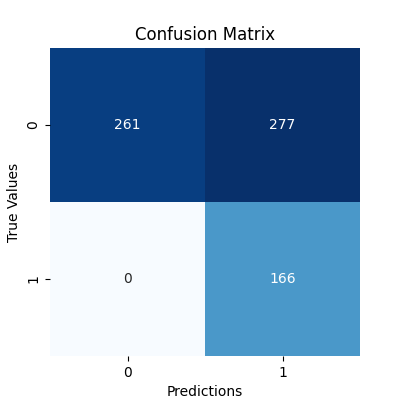

---
# Our models
---

### **Logistic Regression**

### **K-Nearest Neighbor

### **Random Forest**

### **DecisionTreeClassifier**

The Decision Tree Classifier was chosen to address the unbalanced dataset that we have.

Various scoring methods and weights were tested to address the issue of the unbalanced dataset. However, the most suited scoring method that was found during the process is the 'balanced_accuracy'

| Feature                         | Importance |
|--------------------------------|:----------:|
| Contract_Two year            | 0.354717   |
| Contract_One year            | 0.209229   |
| Tenure Months                | 0.099239   |
| Dependents_Yes               | 0.093631   |
| Internet Service_Fiber optic  | 0.092869   |
| Latitude                      | 0.035499   |
| Streaming Movies_Yes         | 0.033793   |
| Monthly Charges              | 0.027313   |
| Longitude                    | 0.014449   |
| Internet Service_No          | 0.013449   |
| Phone Service_Yes            | 0.012041   |
| Payment Method_Electronic check | 0.006196   |
| Online Security_Yes          | 0.003894   |
| Senior Citizen_Yes           | 0.003683   |

---
# Scores of the various classification models
---

**Explanation of Metrics:**

>    **Precision**: The proportion of true positive predictions out of all positive predictions. 
     **Recall**: The proportion of true positive predictions out of all actual positive instances. 
     **F1-score**: The harmonic mean of precision and recall, balancing both metrics. 
     **Support**: The number of actual occurrence 

## Results

**Logistic Regression**
|               | Precision | Recall | F1-Score | Support |
|---------------|:---------:|:------:|:-------:|:-------:|
| **Class 0**   | 0.84     | 0.91   | 0.87    | 783     |
| **Class 1**   | 0.65     | 0.49   | 0.56    | 274     |
| **Accuracy**  | -        | -      | 0.80    | 1057    |
| **Macro Avg** | 0.74     | 0.70   | 0.71    | 1057    |
| **Weighted Avg** | 0.79     | 0.80   | 0.79    | 1057    |

  
**K-Nearest Neighbor** (weights=uniform)

|               | Precision | Recall | F1-Score | Support |
|---------------|:---------:|:------:|:-------:|:-------:|
| **Class 0**   | 0.83     | 0.81   | 0.82    | 783     |
| **Class 1**   | 0.49     | 0.51   | 0.50    | 274     |
| **Accuracy**  | -        | 0.74   | -       | 1057    |
| **Macro Avg** | 0.66     | 0.66   | 0.66    | 1057    |
| **Weighted Avg** | 0.74     | 0.74   | 0.74    | 1057    |

  
**Random Forest** (scoring=accuracy, class_weights={0: 1, 1: 1})
|               | Precision | Recall | F1-Score | Support |
|---------------|:---------:|:------:|:-------:|:-------:|
| **Class 0**   | 0.86     | 0.90   | 0.88    | 783     |
| **Class 1**   | 0.66     | 0.57   | 0.61    | 274     |
| **Accuracy**  | -        | -      | 0.81    | 1057    |
| **Macro Avg** | 0.76     | 0.73   | 0.74    | 1057    |
| **Weighted Avg** | 0.81     | 0.81   | 0.81    | 1057    |

  

**DecisionTreeClassifier** (scoring=balanced_accuracy, class_weights={0: 0.5, 1: 1.5})
|               | Precision | Recall | F1-Score | Support |
|---------------|----------|-------|---------|--------|
| Class 0       | 0.93     | 0.67  | 0.78    | 783    |
| Class 1       | 0.48     | 0.86  | 0.61    | 274    |
| Accuracy      | -        | 0.72  | -       | 1057   |
| Macro Avg     | 0.71     | 0.77  | 0.70    | 1057   |
| Weighted Avg  | 0.82     | 0.72  | 0.74    | 1057   |

  

---
# Validation of best model (Ramdom Forest), of balanced model (DecisionTreeClassifier) and of client's model (Churn Score)
---
In this notebook, we will be validating and comparing different models together

Here are the three models that will be validated and for which we will be comparing the results:
1. The best model found, which is a Random Forest model, based on the accuracy score.
2. The best model based on the balanced accuracy score, which is a Decision Tree Classifier model.
3. The client's actual model from which the Churn Score is calculated.

## Results

The accuracy is not the only scores that matters. As seen during this project, the scoring method best suited to optimize a Classification model is really dependent on the goal that the model need to achieve.

In this case, the client wanted to forecast the hit event the most accurately while minimizing the missed event. Therefore, a scoring method that would have balanced the dataset and try to find the best model that tend to have 0 False Negative, while optimizing the balanced accuracy would have been the best scoring method for this project.

  

It is a lesson learn that a model with the most accuracy does not always provide the best forecast.

We were not able to provide a better model than the pre-existing model used to produce the Churn Score and suit better the client's needs.

| Balanced Model DecisionTreeClassifier              | Balanced Model Random Forest                  | Client pre-existing model  Churn Score               |
|-----------------------|-----------------------|-----------------------|
|  |  |   | 

   

    
####  Balanced Model (DecisionTreeClassifier)

| Metric       | Class 0 | Class 1 | Accuracy | Macro Avg | Weighted Avg |
|--------------|:-------:|:-------:|:--------:|:---------:|:------------:|
| **Precision**| 0.93    | 0.47    | -        | 0.70      | 0.82         |
| **Recall**   | 0.72    | 0.83    | -        | 0.77      | 0.74         |
| **F1-Score** | 0.81    | 0.60    | 0.74     | 0.71      | 0.76         |
| **Support**  | 538     | 166     | 704      | 704       | 704          |

  

    
####  Balanced Model (Random Forest)

| Metric       | Class 0 | Class 1 | Accuracy | Macro Avg | Weighted Avg |
|--------------|:-------:|:-------:|:--------:|:---------:|:------------:|
| **Precision**| 0.86    | 0.66    | -        | 0.76      | 0.81         |
| **Recall**   | 0.90    | 0.57    | -        | 0.73      | 0.81         |
| **F1-Score** | 0.88    | 0.61    | 0.81     | 0.74      | 0.81         |
| **Support**  | 783     | 274     | 1057     | 1057      | 1057         |

  

    
####  Client Pre-existing Model (Churn Score)

| Metric       | Class 0 | Class 1 | Accuracy | Macro Avg | Weighted Avg |
|--------------|:-------:|:-------:|:--------:|:---------:|:------------:|
| **Precision**| 1.00    | 0.37    | -        | 0.69      | 0.85         |
| **Recall**   | 0.49    | 1.00    | -        | 0.74      | 0.61         |
| **F1-Score** | 0.65    | 0.55    | 0.61     | 0.60      | 0.63         |
| **Support**  | 538     | 166     | 704      | 704       | 704          |
  
---
# Conclusion
---
We learned a valuable lesson.  that a model with the most accuracy does not always provide the best forecast.

We were not able to provide a better model than the pre-existing client's model used to produce the Churn Score.
